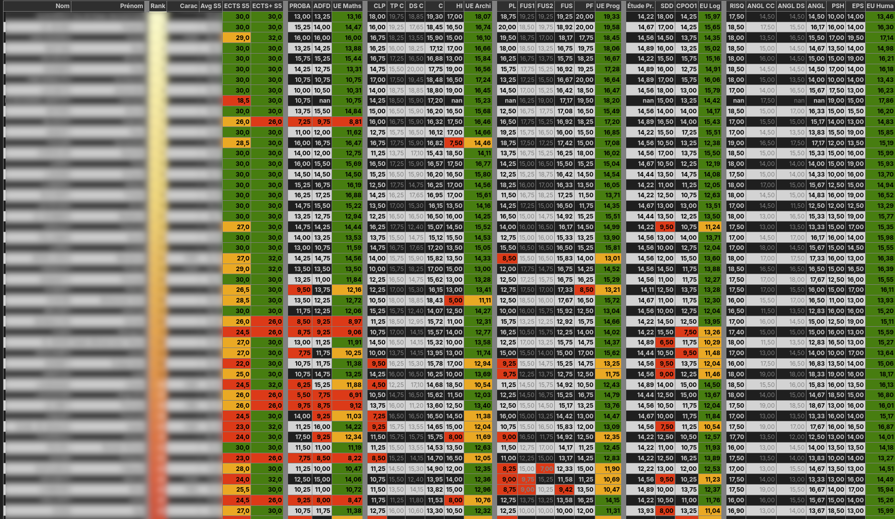

#  A notebook for managing a teaching year

This notebook manages students' marks on two semesters.
It is generic so that ones can define their own teaching modules, exams, etc. to compute statistics per student.




## Installation

The notebook requires Python 3 (tested using Python 3.12, may not work using 3.13):
`python -V` to check your version


Python packages to install: see the first cell of the notebook.


To render the tables correctly, I recommend the use of VSCode with the following plugins:

`Jupyter`, `Jupyter Notebook Renderers`, `Pylance`, `Python`


## Usage

To make the notebook working with your teaching year, the main cell to edit is untitled: *Year specific variables*. It contains the description of the two semesters and some additional details to adapt.

If the name of an exam change between two years, the notebook will not be able to reuse the marks of the previous year. Your have to add them manually using the variables `other_marks_semester1` and `other_marks_semester2`. Use these variables to add or erase a mark. A mark of 30 means that the student must not do this exam (and the mark is not considered in the means).

The notebook reads CSV files of the exams, the student lists, and additional information.
My current folder layout (one can adapt), is:

```
2024-2025
   examens.ipynb
   examens/
       The student lists CSV files
       ranking-prev-year.csv % Provides the ranking of the students during their previous year, exported from Pegase (export each exam)
       specificities.csv     % Specific attributes of some students
       S5/                   % The CSV files of the exams of the first semester
       S6/                   % The CSV files of the exams of the second semester
   graphics/                 % Auto created. Will contain output results
       stds/                 % Auto created. Output data related to student groups
           indiv/            % Auto created. Output data related to each student
../2023-2024/                % The folder of the previous year. Follow the same layout than 2024-2025. Used to grab the exams of the previous year. Not mandatory
../../../photos/             % The pictures of each student (from the the Ksaar app). Used to build the individual tables.
```

To get the CSV files of the student lists for each semester, go on Pegase (the `coc` application), select 'semestre' in 'Type d'objet'.

The folder `examens` in this repository contain template files for `ranking-prev-year.csv` and `specificities.csv`.

## Current issues

The CSV files of exams can contain non-numerical values (e.g. 'ABS INJ') that prevent the correct loading of a CSV file. Currently, you can to manually remove those tokens from the files.


Commun Python installation issues:
- if you have a message like '*no module named pip*', try: `python -m ensurepip --default-pip`
- if you have to switch between two versions of python, use `alternatives` as explained here: https://linuxconfig.org/how-to-switch-between-python-versions-on-fedora-linux

